<h2>TensorFlow-FlexUNet-Image-Segmentation-BraTS-PEDs-T2F (2026/09/04)</h2>
Sarah T. Arai 
Software Laboratory antillia.com  
This is the first experiment of Image Segmentation for <b>BraTS-PEDs-T2F </b>
 based on
our <a href="https://github.com/sarah-antillia/TensorFlow-FlexUNet-Image-Segmentation-Model">TensorFlowFlexUNet Model</a>
 (<b>TensorFlow Flexible UNet Image Segmentation Model for Multiclass</b>) and a 512x512 pixels cropped PNG
 <a href="https://drive.google.com/file/d/1dUfd8Cfas_NrslM2L1rMwK01eX49Xj4T/view?usp=sharing">
Augmented-BraTS-PEDs-T2F-ImageMask-Dataset.zip</a> with colorized masks (<a href="https://creativecommons.org/licenses/by-sa/4.0/">CC BY-SA 4.0</a>),
  which was derived by us from the Kaggle website 
  
<a href="https://www.kaggle.com/datasets/awansaad6797/brats-peds-the-brain-tumor-segmentation-dataset">
<b>BraTS-PEDs | The Brain Tumor Segmentation Dataset</b>
</a> by Malik Saad Ahmed.
  

<b>Actual Image Segmentation for BraTS-PEDs-T2F Images of 512x512 pixels</b> 
As shown below, the inferred masks resemble the ground-truth masks.  
 
<a href="#1"><b>class_color_mapping_table</b></a> 
 
<table>
<tr>
<th>Input: image</th>
<th>Mask (ground_truth)</th>
<th>Prediction: inferred_mask</th>
</tr>
<tr>
<td>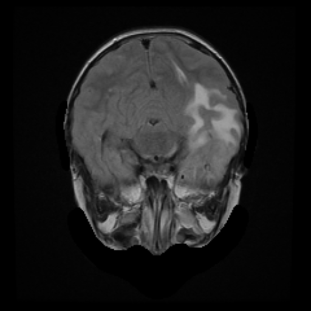</td>
<td>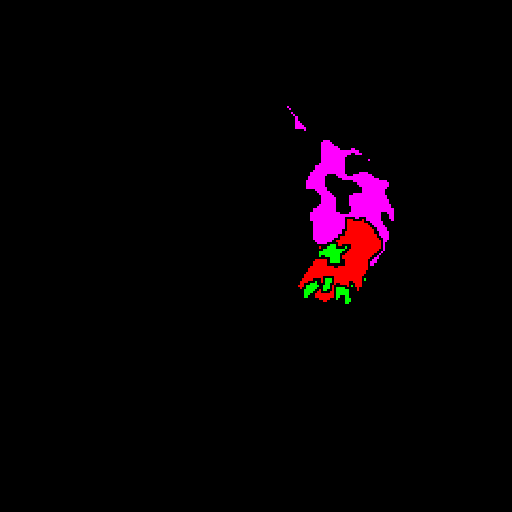</td>
<td></td>
</tr>
<tr>
<td>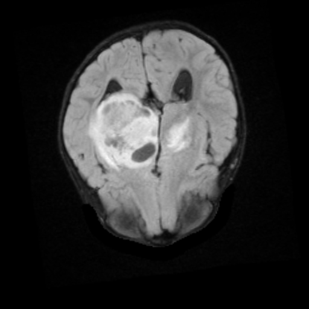</td>
<td>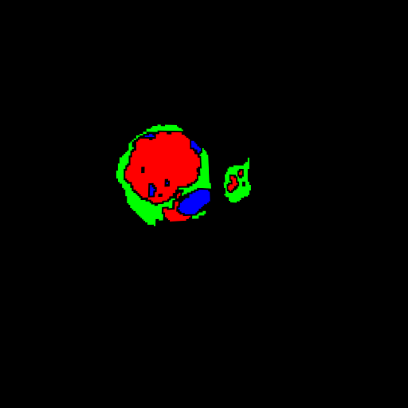</td>
<td>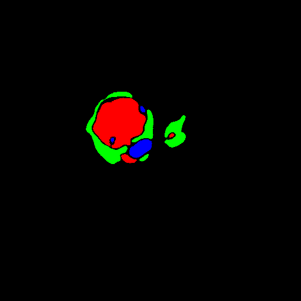</td>
</tr>
<tr>
<td>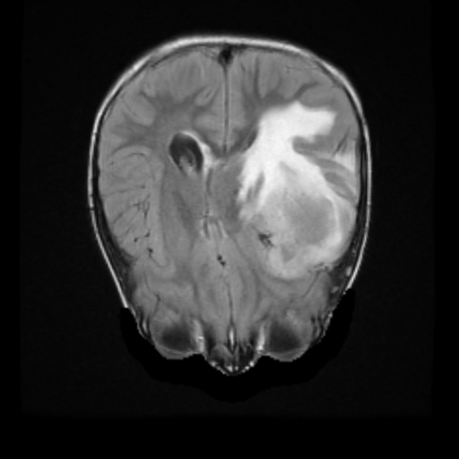</td>
<td>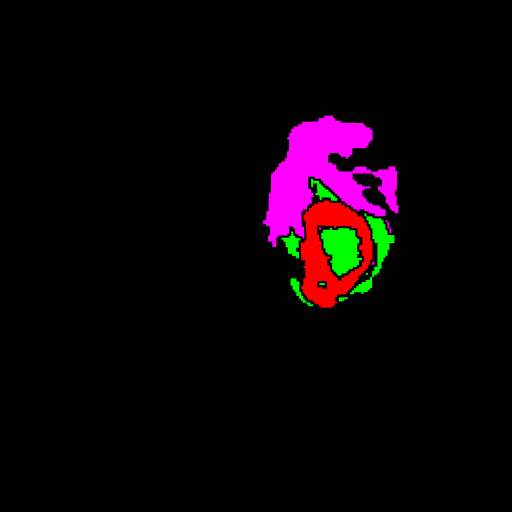</td>
<td>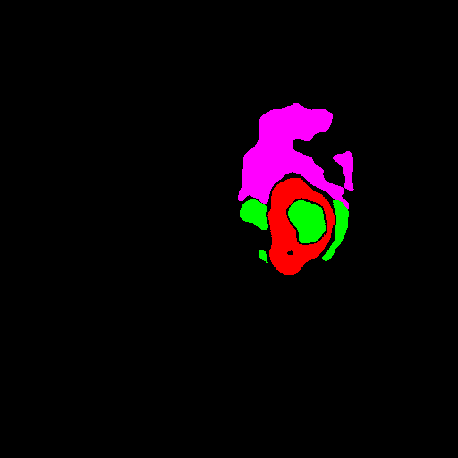</td>
</tr>
</table>

 
<h3>1. Dataset Citation</h3>
The dataset used here was derived from the following Kaggle website:  
<a href="https://www.kaggle.com/datasets/awansaad6797/brats-peds-the-brain-tumor-segmentation-dataset">
<b>BraTS-PEDs | The Brain Tumor Segmentation Dataset</b>
</a> by Malik Saad Ahmed.
  
The following explanation(abstract) was taken from the website <a href="https://www.cancerimagingarchive.net/collection/brats-peds/">
BraTS-PEDs | The Brain Tumor Segmentation in Pediatric Magnetic Resonance Imaging</a>.
  
<b>Abstract</b> 
Pediatric central nervous system tumors are the leading cause of cancer-related mortality in children. 
Pediatric high-grade gliomas, particularly diffuse midline gliomas (DMGs), have a dismal prognosis, 
with five-year survival rates below 20%. The BraTS-PEDs dataset provides a comprehensive, multi-institutional, 
international resource focused on this disease. It includes 457 pediatric patients with high-grade gliomas, 
primarily DMGs, aggregated from major pediatric neuro-oncology consortia and institutions, including the 
Children’s Brain Tumor Network (CBTN), DMG/DIPG Registry, and multiple academic centers.  
The dataset contains multiparametric structural MRI, expert tumor segmentations, imaging acquisition parameters, 
demographic variables, and clinical outcomes such as overall and progression-free survival. 
By integrating standardized imaging, annotations, and clinical data, BraTS-PEDs enables reproducible 
research and accelerates translation of imaging science into clinical impact.
 
 
<b>License</b> 
<a href="<a href="https://creativecommons.org/licenses/by-sa/4.0/">
CC BY-SA 4.0</a>.
 
 
For more information, please refer to 
<a href="https://www.cancerimagingarchive.net/collection/brats-peds/">
BraTS-PEDs | The Brain Tumor Segmentation in Pediatric Magnetic Resonance Imaging</a>.
  
<h3>
2 BraTS-PEDs-T2F  ImageMask Dataset
</h3>
<h3>2.1 Download ImageMask Dataset</h3>
 If you would like to train this BraTS-PEDs-T2F Segmentation model yourself,
 please download the dataset from Google Drive  
 <a href="https://drive.google.com/file/d/1dUfd8Cfas_NrslM2L1rMwK01eX49Xj4T/view?usp=sharing">
Augmented-BraTS-PEDs-T2F-ImageMask-Dataset.zip</a> ( <a href="<a href="https://creativecommons.org/licenses/by-sa/4.0/">
CC BY-SA 4.0</a>). 
Expand the downloaded ImageMaskDataset and put it under <b>./dataset</b> folder to be
 
<pre>
./dataset
└─BraTS-PEDs-T2F
    ├─test
    │   ├─images
    │   └─masks
    ├─train
    │   ├─images
    │   └─masks
    └─valid
         ├─images
         └─masks
</pre>
 
<b>BraTS-PEDs-T2F Statistics</b> 
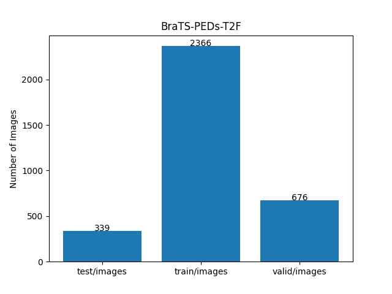 
 
As shown above, the number of images of train and valid datasets is not large enough to use for the
 training set of our segmentation model.
 
 
<h3>2.2 Derivation of BraTS-PEDs-T2F ImageMask Dataset</h3>
The folder structure of the original dataset is as follows.
It contains a lot of types of NIfTI files,
but we used only one type of T2F (<b>BraTS-PED-*-t2f.nii</b>) NIfTI file in this experiment.
<pre>
./dataset
 ├─BraTS-PED-00001-000-seg.nii
 ├─BraTS-PED-00001-000-t1c.nii
 ├─BraTS-PED-00001-000-t1n.nii
 ├─BraTS-PED-00001-000-t2f.nii
 ├─BraTS-PED-00001-000-t2w.nii
,,,
 ├─BraTS-PED-00022-000-seg.nii
 ├─BraTS-PED-00022-000-t1c.nii
 ├─BraTS-PED-00022-000-t1n.nii
 └─BraTS-PED-00022-000-t2f.nii  
</pre>
<b>Step 1</b> 
We generated a 512x512 pixels upscaled PNG ImageMask Dataset with colorized masks 
 from the image slices of <b>BraTS-PED-*-t2f.nii</b> 
and the coresspoding mask slices of <b>BraTS-PED-*-seg.nii</b>.
However, for simplicity, we excluded all black empty masks and the corresponding images, because they are irrelevant for 
training our segmentation model.  
We also used the following class_color_mapping table to generate the colorized masks.
  
<a id="1"><b>class_color_mapping_table</b></a>
  
<table border=1 style='border-collapse:collapse;' cellpadding='5'>
<tr><th>Indexed Color</th><th>Color</th><th>RGB</th><th>Class</th></tr>
<tr><td>1</td><td with='80' height='auto'></td><td>(255, 0, 0)</td>
<td>Non-enhancing Tumor Core / Necrosis: NET/NCR</td></tr>
<tr><td>2</td><td with='80' height='auto'></td><td>(0, 255, 0)</td>
<td>Peritumoral Edema: ED</td></tr>
<tr><td>3</td><td with='80' height='auto'></td><td>(0, 0, 255)</td>
<td>GD-Enhancing Tumor: ET</td></tr>
<tr><td>4</td><td with='80' height='auto'></td><td>(255, 0, 255)</td>
<td>Cystic Component / Infiltration: CC</td></tr>
</table>
 
<b>Step 2</b> 
To address the limited size of the original dataset, we generated our own 
<a href="https://drive.google.com/file/d/1dUfd8Cfas_NrslM2L1rMwK01eX49Xj4T/view?usp=sharing">
Augmented-BraTS-PEDs-TF2-ImageMask-Dataset</a> from the upscaled ImageMask Dataset
by using the following offline augmentation tools. 
<a href="https://github.com/sarah-antillia/Image-Deformation-Tool">Image-Deformation-Tool</a> 
<a href="https://github.com/sarah-antillia/Image-Distortion-Tool">Image-Distortion-Tool</a>
  
<h3>2.3 Train Sample Images and Masks</h3>
<b>Train_sample_images</b> 
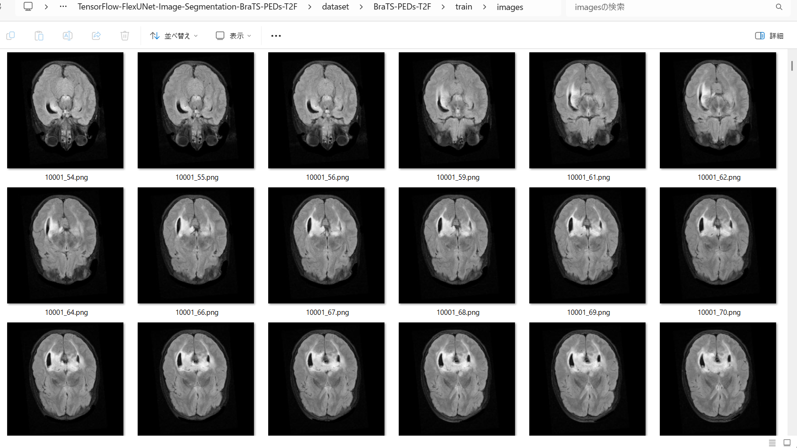
 
<b>Train_sample_masks</b> 
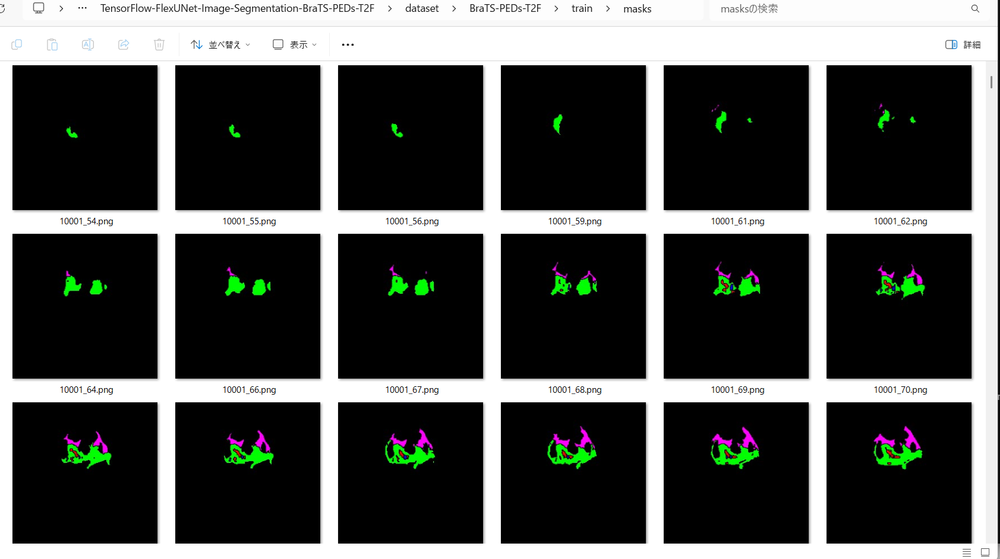
 

<h3>
3 Train TensorFlowFlexUNet Model
</h3>
 We trained the BraTS-PEDs-T2F TensorFlowFlexUNet model using the following
<a href="./projects/TensorFlowFlexUNet/BraTS-PEDs-T2F/train_eval_infer.config"> <b>train_eval_infer.config</b></a> file.  
Please move to ./projects/TensorFlowFlexUNet/BraTS-PEDs-T2F and run the following bat file. 
<pre>
>1.train.bat
</pre>
This simply runs the following command. 
<pre>
>python ../../../src/TensorFlowFlexUNetTrainer.py ./train_eval_infer.config
</pre>

<b>Model parameters</b> 
Defined a small <b>base_filters=16 </b> and large <b>base_kernels=(11,11)</b> for the first Conv Layer of Encoder Block of 
<a href="./src/TensorFlowFlexUNet.py">TensorFlowFlexUNet.py</a> 
and a large <b>num_layers=8</b> (including a bridge between Encoder and Decoder Blocks).
<pre>
[model]
;You may specify your own UNet class derived from our TensorFlowFlexModel
model         = "TensorFlowFlexUNet"
generator     =  False
image_width    = 512
image_height   = 512
image_channels = 3
num_classes    = 5
base_filters   = 16
base_kernels   = (11,11)
num_layers     = 8
dropout_rate   = 0.04
dilation       = (1,1)
</pre>
<b>Learning rate</b> 
Defined a small learning rate.  
<pre>
[model]
learning_rate  = 0.00007
</pre>
<b>Loss and metrics functions</b> 
Specified "categorical_crossentropy" and <a href="./src/dice_coef_multiclass.py">"dice_coef_multiclass"</a>. 
<pre>
[model]
loss           = "categorical_crossentropy"
metrics        = ["dice_coef_multiclass"]
</pre>
<b>Dataset class</b> 
Specifed <a href="./src/ImageCategorizedMaskDataset.py">ImageCategorizedMaskDataset</a> class. 
<pre>
[dataset]
class_name    = "ImageCategorizedMaskDataset"
</pre>
 
<b>Learning rate reducer callback</b> 
Enabled learing_rate_reducer callback, and a small reducer_patience.
<pre> 
[train]
learning_rate_reducer = True
reducer_factor     = 0.4
reducer_patience   = 4
</pre>
<b>Early stopping callback</b> 
Enabled early stopping callback with the patience parameter.
<pre>
[train]
patience      = 10
</pre>

<b>RGB Color map</b> 
Specified RGB color map dict for BraTS-PEDs-T2F 1+4 classes. 
<pre>
[mask]
mask_datatyoe    = "categorized"
mask_file_format = ".png"
; BraTS-PEDs-T2F RGB color map dict for 1+4 classes.
;        Background: black, NET/NCR: red, ED: green, ET: blue, CC: magenta
rgb_map = {(0,0,0):0,(255,0,0):1, (0,255,0):2,(0,0,255):3,(255,0,255):4}
</pre>

<b>Epoch change inference callback</b> 
Enabled <a href="./src/EpochChangeInferencer.py">epoch_change_infer callback</a></b>. 
<pre>
[train]
epoch_change_infer       = True
epoch_change_infer_dir   =  "./epoch_change_infer"
num_infer_images         = 6
</pre>

By using this callback, on every epoch_change, the inference procedure can be called
 for 6 images in the <b>mini_test</b> folder. This will help you confirm how the predicted mask changes 
 at each epoch during your training process.  
  
As shown below, early in the model training, the predicted masks from our UNet segmentation model showed 
discouraging results.
 However, as training progressed through the epochs, the predictions gradually improved. 
   
 
<b>Epoch_change_inference output at starting (epoch 1,2,3)</b> 
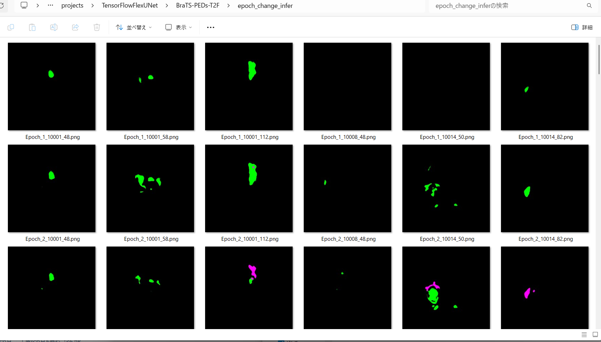 
 
<b>Epoch_change_inference output at middlepoint (epoch 13,14,15)</b> 
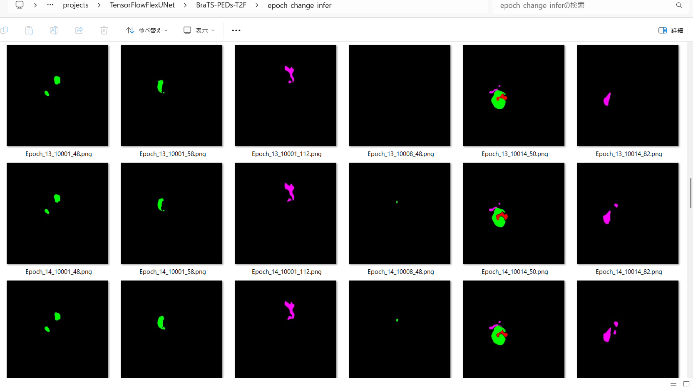 
 
<b>Epoch_change_inference output at ending (epoch 28,29,30)</b> 
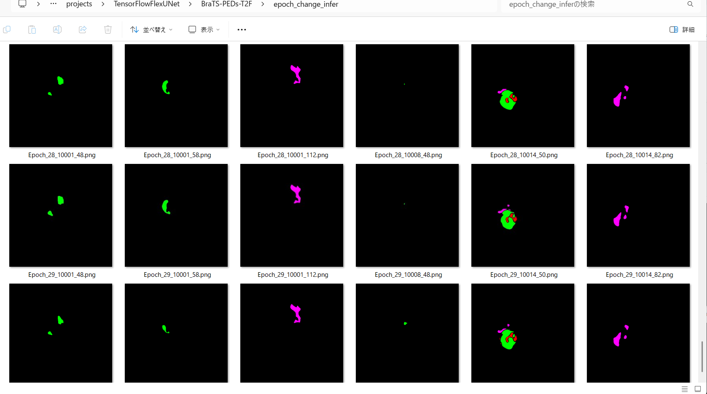 
 
In this experiment, the training process was terminated at epoch 30. 
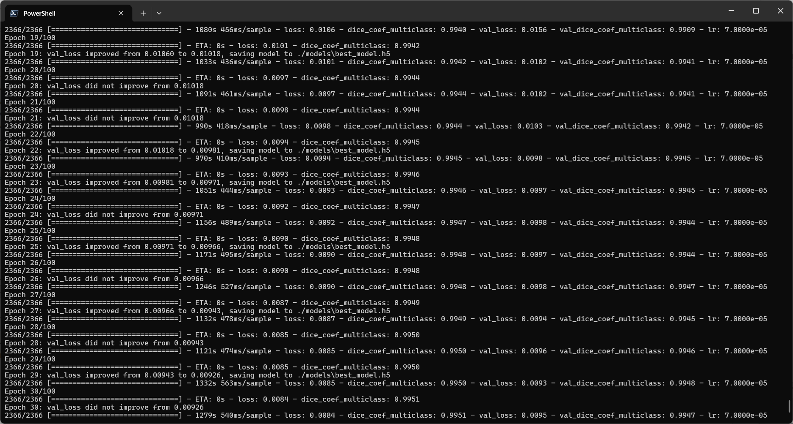 
 
<a href="./projects/TensorFlowFlexUNet/BraTS-PEDs-T2F/eval/train_metrics.csv">train_metrics.csv</a> 
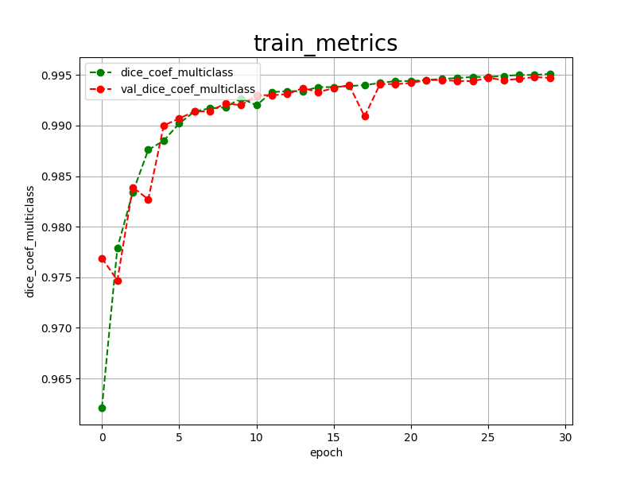 
 
<a href="./projects/TensorFlowFlexUNet/BraTS-PEDs-T2F/eval/train_losses.csv">train_losses.csv</a> 
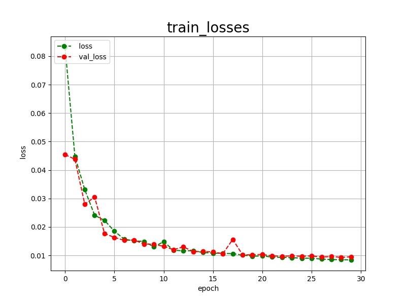 
 
<h3>
4 Evaluation
</h3>
Please move to <b>./projects/TensorFlowFlexUNet/BraTS-PEDs-T2F</b> folder,
and run the following bat file to evaluate the TensorFlowUNet model for BraTS-PEDs-T2F. 
<pre>
./2.evaluate.bat
</pre>
This simply runs the following command.
<pre>
python ../../../src/TensorFlowFlexUNetEvaluator.py ./train_eval_infer_aug.config
</pre>

Evaluation console output: 
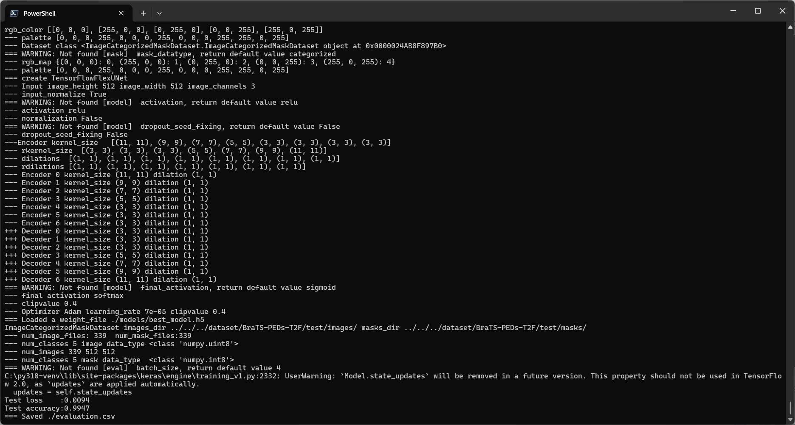
  Image-Segmentation-BraTS-PEDs-T2F

<a href="./projects/TensorFlowFlexUNet/BraTS-PEDs-T2F/evaluation.csv">evaluation.csv</a> 
The loss (categorical_crossentropy) to this BraTS-PEDs-T2F/test was very low, and dice_coef_multiclass very  
high, as shown below.
 
<pre>
categorical_crossentropy,0.0096
dice_coef_multiclass,0.9954
</pre>
 

<h3>
5 Inference
</h3>
Please move to <b>./projects/TensorFlowFlexUNet/BraTS-PEDs-T2F</b> folder
and run the following bat file to infer segmentation regions for images using the trained TensorFlowUNet model for
 BraTS-PEDs-T2F. 
<pre>
./3.infer.bat
</pre>
This simply runs the following command.
<pre>
python ../../../src/TensorFlowFlexUNetInferencer.py ./train_eval_infer_aug.config
</pre>

<b>mini_test_images</b> 
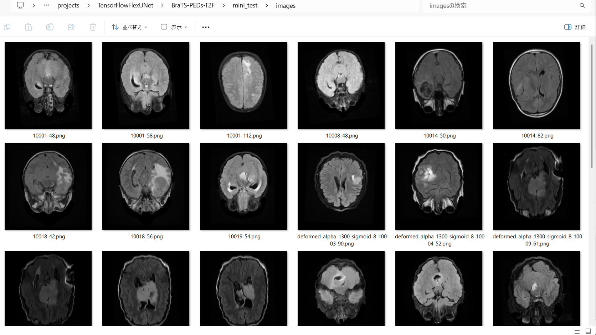 
<b>mini_test_mask(ground_truth)</b> 
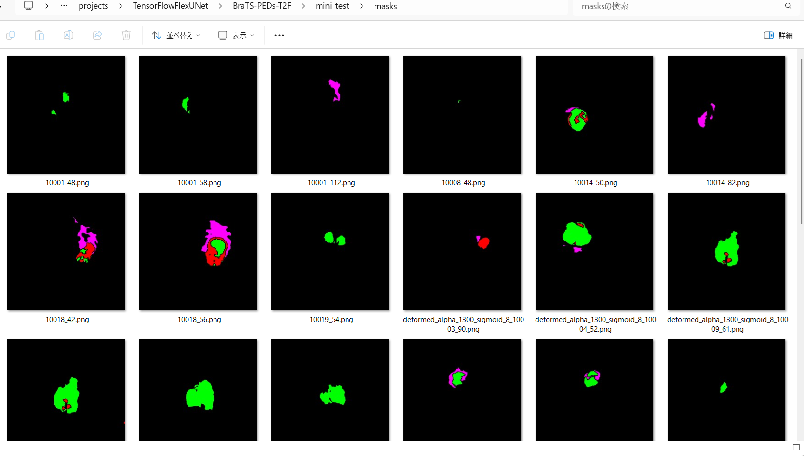 

<b>Inferred test masks</b> 
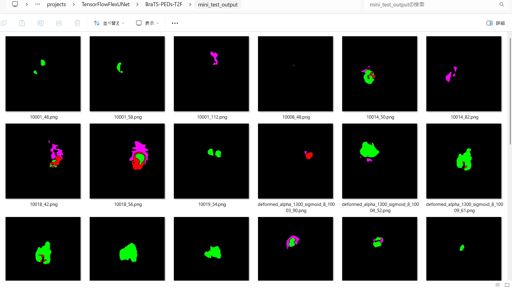 
 

<b>Enlarged images and masks for BraTS-PEDs-T2F Images of 512x512 pixels</b> 
As shown below, the inferred masks look similar to the ground truth masks. 
 
<a href="#1"><b>class-color-mapping-talbe</b></a> 
 
<table>
<tr>
<th>Image</th>
<th>Mask (ground_truth)</th>
<th>Inferred-mask</th>
</tr>
<tr>
<td>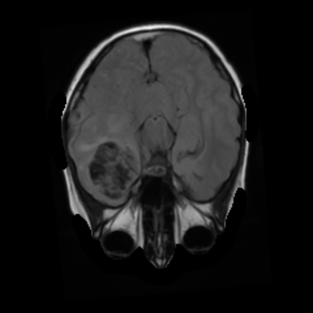</td>
<td></td>
<td>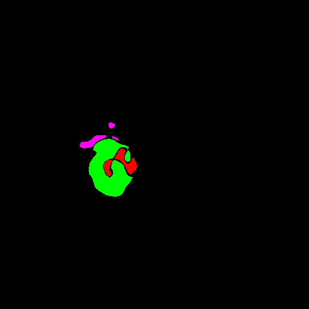</td>
</tr>
<tr>
<td>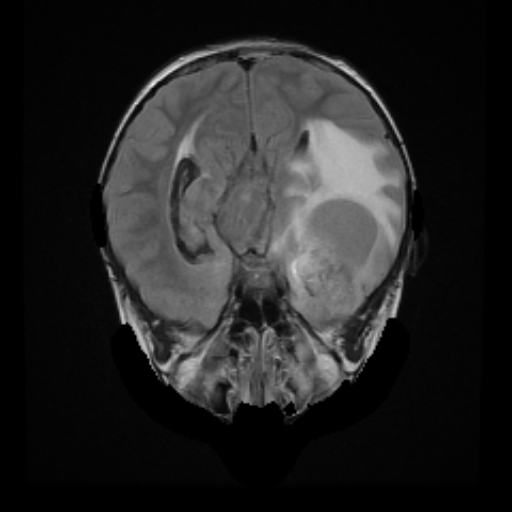</td>
<td>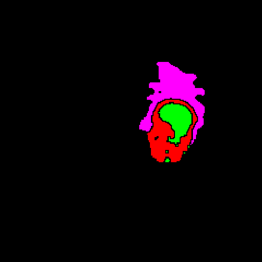</td>
<td>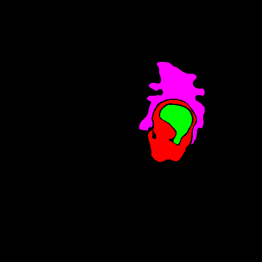</td>
</tr>
<tr>
<td>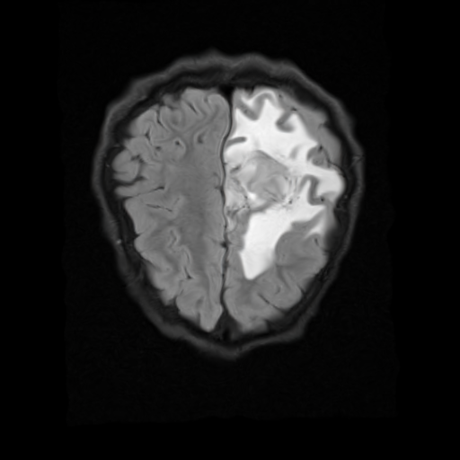</td>
<td>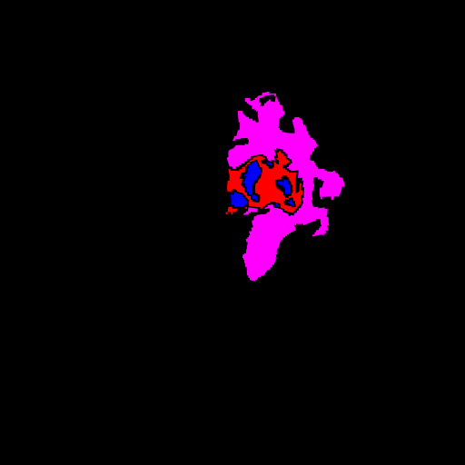</td>
<td>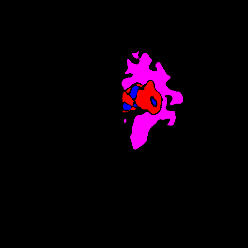</td>
</tr>
<tr>
<td>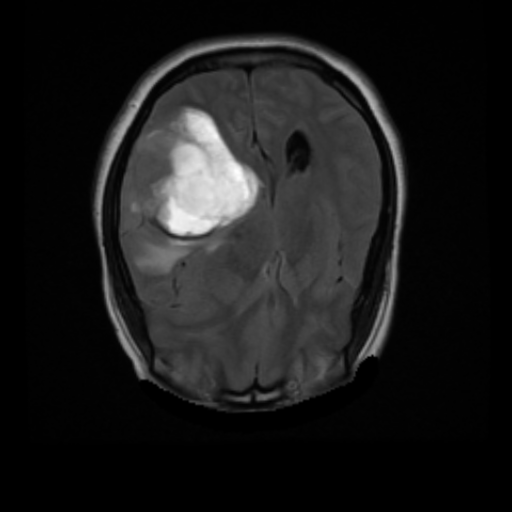</td>
<td>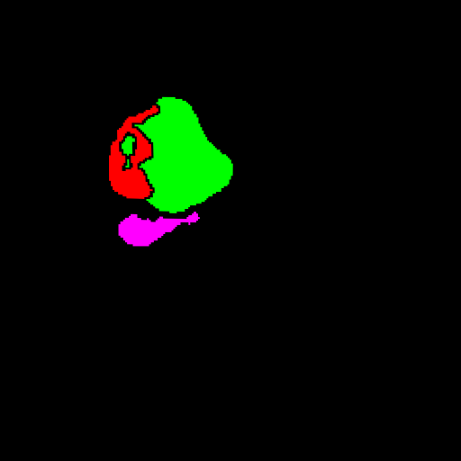</td>
<td>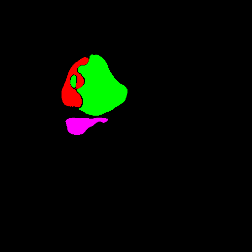</td>
</tr>
<tr>
<td></td>
<td></td>
<td></td>
</tr>
<tr>
<td>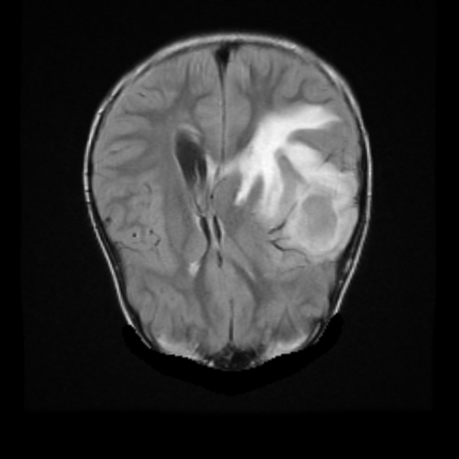</td>
<td>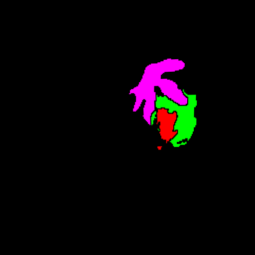</td>
<td>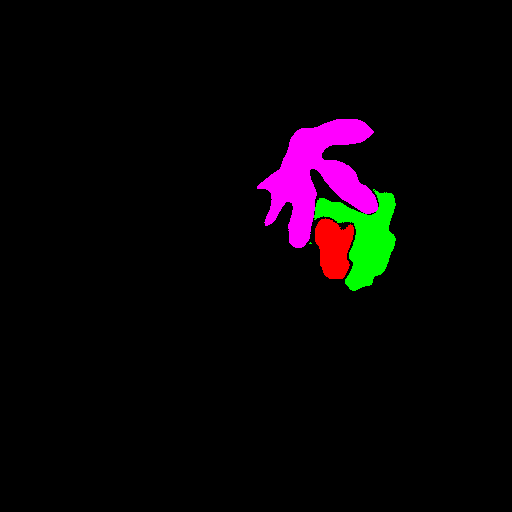</td>
</tr>
</table>

 
<h3>
6 3D Volume Segmentation
</h3>
Please move to <b>./projects/TensorFlowFlexUNet/BraTS-PEDs-T2F</b> folder
and run the following bat file to infer image segmentation for 2D slices of 3D volume NIfTI files
 using the trained TensorFlowFlexUNet model for BraTS-PEDs-T2F. 
<pre>
>./5.infer3d.bat
</pre>
This simply runs the following command.
<pre>
>python ../../../src/TensorFlowFlexUNet3DInferencer.py ./train_eval_infer.config
</pre>
<b>infer3d section </b> in <a href="./projects/TensorFlowFlexUNet/BraTS-PEDs-T2F/train_eval_infer.config">
train_eval_infer.config
<a></b>
<pre>
[infer3d] 
; Specify an images_dir which contains NIfTI or NPY files
images_dir    = "./mini_test_3d/images/"
output_dir    = "./mini_test_3d_output/"
slice_shape_order = "hwd"
slice_normalize = True
slice_resize   = (512,512)
; Specify a cv2.rotation mode as a string.
slice_rotation = "cv2.ROTATE_90_COUNTERCLOCKWISE" 

mask_overlay  = True
</pre>

<b>Acutual Image Segmentation for 2D Slices of a BraTS-PEDs-T2F NIfTI</b> 
Some Slices, Inferred Masks and Mask overlays for a 3D volume <b>BraTS-PED-00001-000-t2f.nii</b> file in 
<b>archive/</b> folder. 
 
<a href="#1"><b>class-color-mapping-talbe</b></a> 
 
<table>
<tr>
<th>Image</th>
<th>Inferred-mask</th>
<th>Mask overlay</th>
</tr>

<tr>
<td>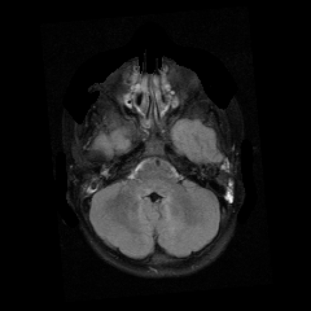</td>
<td>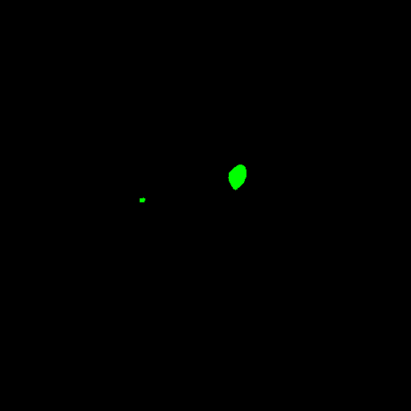</td>
<td>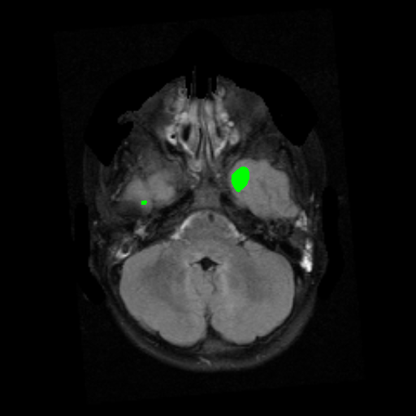</td>
</tr>

<tr>
<td>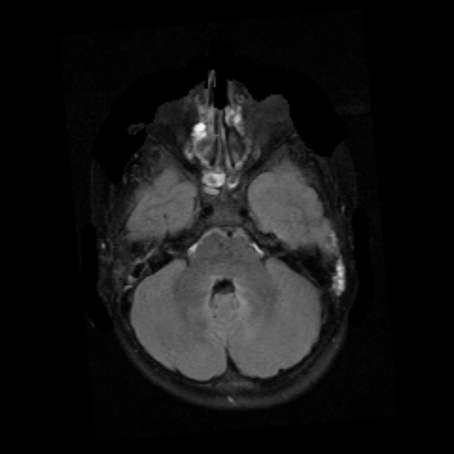</td>
<td>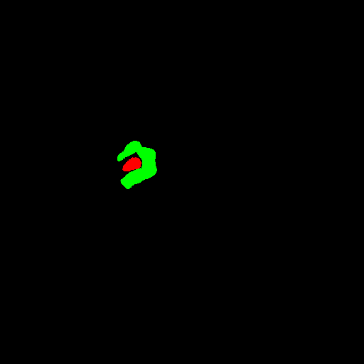</td>
<td>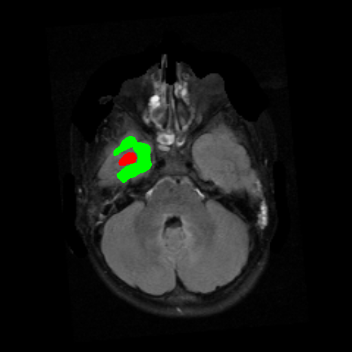</td>
</tr>
<tr>
<td>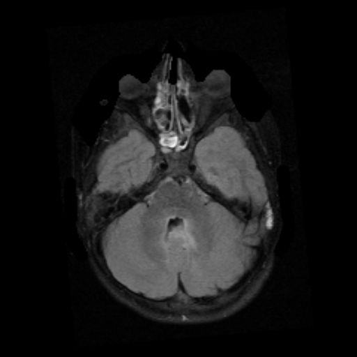</td>
<td>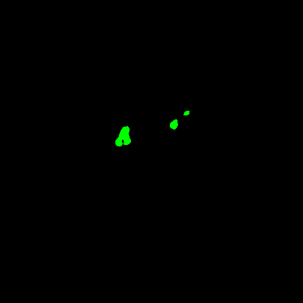</td>
<td>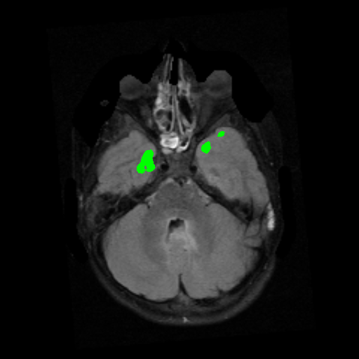</td>
</tr>
<tr>
<td>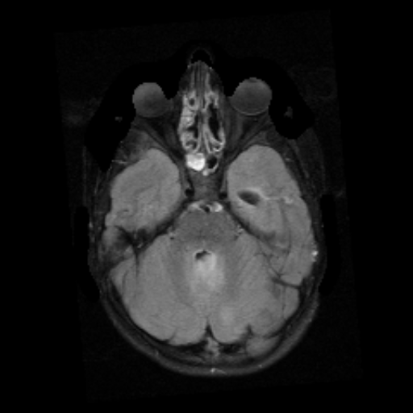</td>
<td>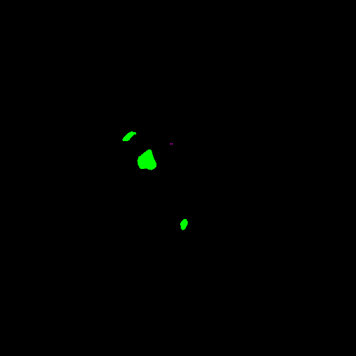</td>
<td>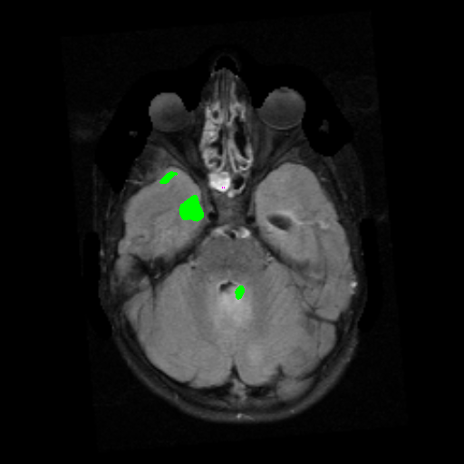</td>
</tr>
<tr>
<td>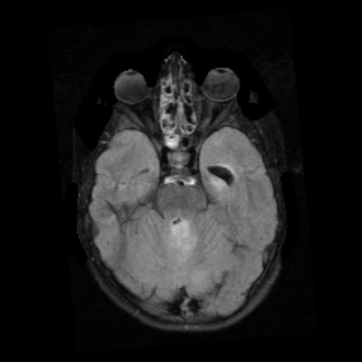</td>
<td>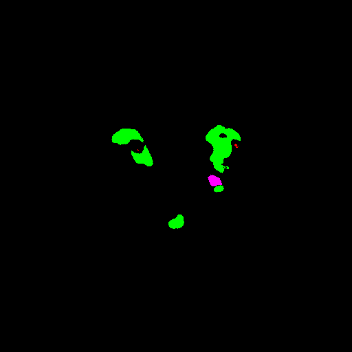</td>
<td>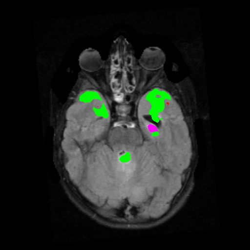</td>
</tr>
<tr>
<td></td>
<td></td>
<td></td>
</tr>

</table>

 
<h3>
7 MaskOverlay Video of 3D Volume Segmentation
</h3>
Please move to <b>./projects/TensorFlowFlexUNet/BraTS-PEDs-T2F</b> folder, and run the following bat file 
to generate <b>overlays.mp4</b> or <b>overlay.gif</b> for MaskOverlays of 3D Volume Segmentation.  
<pre>
>./6.video3d.bat
</pre>
This simply runs the following command.
<pre>
>python ../../../src/MaskOverlayVideoGenerator.py ./train_eval_infer.config
</pre>
 
<b>infer3d section </b> in <a href="./projects/TensorFlowFlexUNet/BraTS-PEDs-T2F/train_eval_infer.config">
train_eval_infer.config
<a></b>
<pre>
[infer3d] 
mask_overlay  = True
; Specify ".mp4" or ".gif".
;video_fileformat  = ".mp4"
video_fileformat  = ".gif"
</pre>
 
<b>overlays.gif</b> 

 

<h3>
References
</h3>
<b>1. TensorFlow-FlexUNet-Image-Segmentation-Multiclass-BraTS2023-Subset</b> 
Toshiyuki Arai 
<a href="https://github.com/sarah-antillia/TensorFlow-FlexUNet-Image-Segmentation-Multiclass-BraTS2023-Subset">
https://github.com/sarah-antillia/TensorFlow-FlexUNet-Image-Segmentation-Multiclass-BraTS2023-Subset
</a>
  
<b>2. TensorFlow-FlexUNet-Image-Segmentation-BraTS-Africa-Glioma-T2W</b> 
Toshiyuki Arai 
<a href="https://github.com/sarah-antillia/TensorFlow-FlexUNet-Image-Segmentation-BraTS-Africa-Glioma-T2W">
https://github.com/sarah-antillia/TensorFlow-FlexUNet-Image-Segmentation-BraTS-Africa-Glioma-T2W
</a>
  
<b>3. TensorFlow-FlexUNet-Image-Segmentation-Multiclass-BraTS2020</b> 
Toshiyuki Arai 
<a href="https://github.com/sarah-antillia/TensorFlow-FlexUNet-Image-Segmentation-Multiclass-BraTS2020">
https://github.com/sarah-antillia/TensorFlow-FlexUNet-Image-Segmentation-Multiclass-BraTS2020
</a>
  
<b>4. TensorFlow-FlexUNet-Image-Segmentation-Model</b> 
Toshiyuki Arai 
<a href="https://github.com/sarah-antillia/TensorFlow-FlexUNet-Image-Segmentation-Model">
https://github.com/sarah-antillia/TensorFlow-FlexUNet-Image-Segmentation-Model
</a>
  
